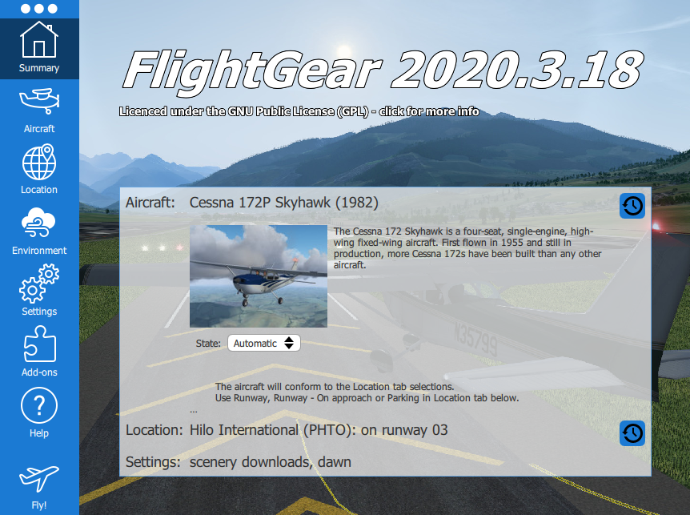
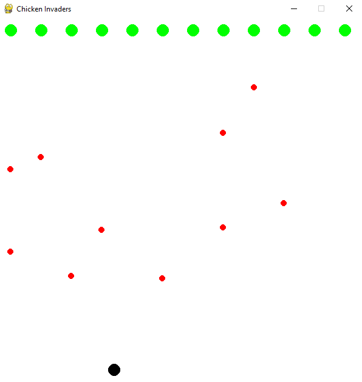
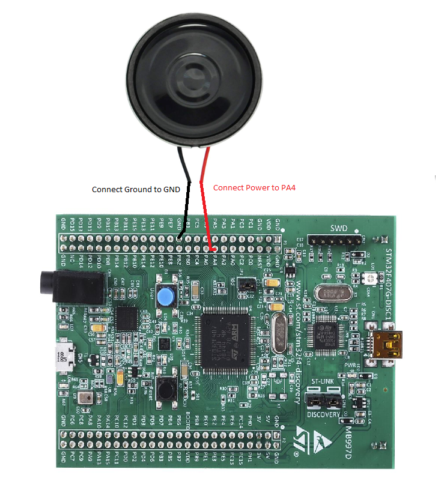

# MSE450-Group3

## About

This project aims to create a real-time control system using an STM32F407VGTx microcontroller board with an integrated accelerometer sensor (LIS3DSH) and DAC with integrated class D speaker drivers. The system reads 3-axis acceleration data from the accelerometer, calculates roll and pitch angles, generates a sine wave based on the calculated angles, controls four onboard LEDs to project the angles, and streams the angles via USB to either a Flight Simulator (FlightGear) or Python game (a simplified version of Chicken Invaders). 

    
	 

## Objectives
	
	1. Read 3-axis acceleration, calculate roll and pitch angles in degrees
	2. Utilize four on-board LEDs to project angles.
	3. Generate a sinusoidal wave with amplitude and frequency proportional to the roll and 
       pitch respectively. Stream sinusoidal wave through speaker 
	4. Stream the angles through USB in real-time and use them to control the aircraft steering 
       within the simulator or player in the Python game.

## Demo

https://media.github.sfu.ca/user/440/files/0515dd3e-aeea-49bd-84e2-13ac9ba43ab5

## Main Parts of Code and Design

1. **Hardware Initialization:**  
The code begins with hardware initialization, configuring the system clock and various peripherals (DAC, I2C, SPI, TIM) needed for the project. The USB device is also initialized to communicate with the Python scripts for the simulator and game on the computer.

2. **Function Definitions:**

    * ACCELERO_IO_Read: This function is responsible for reading data from the accelerometer (LIS3DSH) over the SPI communication interface.
    * ACCELERO_IO_Write: This function is responsible for writing data from the accelerometer (LIS3DSH) over the SPI communication interface.
    * ACCELERO_Init: This function is responsible for initializing the accelerometer (LIS3DSH) for operation. It sets up the necessary configurations and registers in the accelerometer to enable it to measure acceleration data on the three axes.
    * ACCELERO_GetXYZ: This function is used to retrieve the acceleration data from the three axes (X, Y, and Z) of the accelerometer.
    * calcAngles: This function is responsible for calculating the roll and pitch angles based on the raw acceleration data obtained from the accelerometer.
    * setSineData: This function calculates the frequency and amplitude of a sine wave based on the pitch and roll angles and stores the waveform data in a buffer to be output by DAC.
    * HAL_TIM_PeriodElapsedCallback: This function is a callback that triggers when Timer 6 generates an interrupt. It reads accelerometer data, calculates the pitch and roll angles, converts them to string format, and transmits them over USB to the computer.

3. **Main Loop:** 
The main loop of the code continuously runs and consists of the following steps:

    - Reads the accelerometer data and calculates the pitch and roll angles using the ACCELERO_GetXYZ and calcAngles functions (defined in LIS3DSH.h).
    - Converts the pitch and roll angles to strings and transmits them over USB using the CDC_Transmit_FS function.
    - Based on the pitch and roll angles, the code calculates PWM duty cycles for four LEDs (two for pitch and two for roll) to visually represent the angles.
    - The code calls the setSineData function to generate a new sine wave based on the updated pitch and roll angles. The sine wave data is sent to the DAC, and DMA is used for efficient data transfer.

Ultimately, the code successfully interfaces with the accelerometer sensor, calculates pitch and roll angles, generates a sine wave based on the angles, controls LEDs, and communicates the angles to the Simulator and Python game. The system effectively demonstrates real-time control and feedback based on the board's orientation.

### External Connection Diagram

    

## Directions for Using Programs

1. Open `Source Code` folder within STM32 Cube IDE or IDE of your choice, connect both Power/ST-Link and serial USB cables to STM32F407G-DISC or equivalent board, upload project code  

In powershell terminal, navigate to directory containing project files and follow these steps:

2. Run `python venv venv` or `py -3.XX -m venv venv` (XX = version, ex: 3.11) if you have multiple versions of python, to create a virtual environment

3. Enter virtual environment
	* `Set-ExecutionPolicy -ExecutionPolicy Bypass -Scope Process -Force`
	* `.\venv\Scripts\Activate.ps1`
	* `pip install -r requirements.txt`

4. Setup

    a. Flight Simulator:
	* Open FlightGear Simulator
    * In FlightGear setting, input `--telnet=socket,in,30,127.0.0.1,5500,udp` under Additional Settings and enable Download Scenery Automatically under Downloads
    * Start flight by clicking `Fly!` or `Ctrl + F`
	* Set COM port number in Line 10 of `flight_gear.py` based on COM port connection for USB Serial Device found in computers Device Manager under `Ports (COM & LPT)`
	* Run `python flight_gear.py` in correct directory within terminal
	* In top left of simulator, click `Location > Altitude(ft) = 9999 > ok`, press V on keyboard to change POV of aircraft, and control with STM32F407G-DISC Board

    b. Chicken Invaders Game:
    * Set COM port number in Line 26 of `chicken_invader_game.py` based on COM port connection for USB Serial Device found in computers Device Manager under `Ports (COM & LPT)`
    * Run `python chicken_invader_game.py` in correct directory within terminal
    * Control player with STM32F407G-DISC Board, press space bar to shoot
    
    c. Plot Pitch and Roll Data
    * Set COM port number in Line 7 of `plot.py` based on COM port connection for USB Serial Device found in computers Device Manager under `Ports (COM & LPT)`
    * Run `python plot.py` in correct directory within terminal
    * Control STM32F407G-DISC Board to plot poitch and roll values in real time

## Work Flow

	Project rolled out using agile methodology with 3 sprints:
	- 1st sprint was focused on reading accelerometer data, calculating Pitch & Roll
      and creating a connection between the STM32 Device & Local Device.
	- 2nd sprint was focused on understanding PWM and how to use it for adjusting
      brightness of LEDs depending on current pitch or roll angles.
	- 3rd sprint was focused on generating a sinusoidal wave with an amplitude and 
      frequency proportional to roll and pitch angles.

## Future Improvements

	1. Creating my own USB device driver for implementing unique functionalities, OS compoatability, 
       and for educational purposes
	2. Implement calibration routines to ensure accurate sensor readings and compensate for any sensor 
       bias or misalignment (e.g., using an Extended Kalman Filter)
	3. Use PID control to smoothly and dynamically adjust the player's position based on the desired 
       roll and pitch angles.
	4. Implement a feature to record the player's movements using the accelerometer data and replay 
       them later. This can be used for training, analysis, or creating automatic gameplay.
	5. Additional Games made to work with this project
